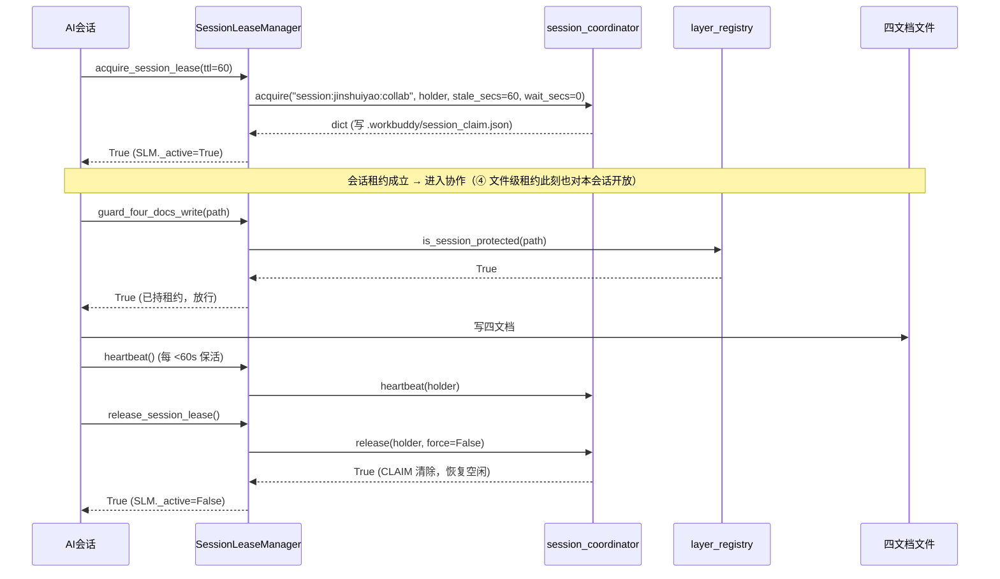
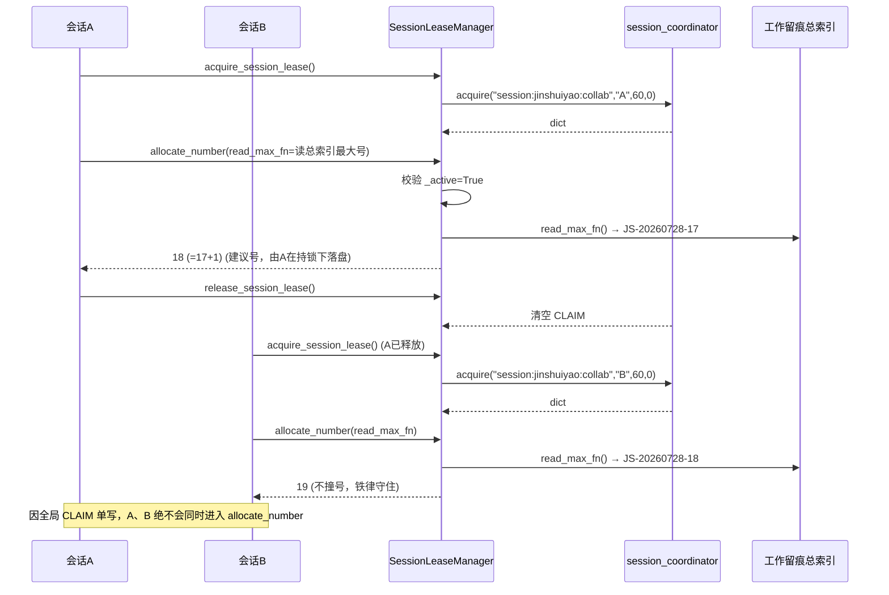
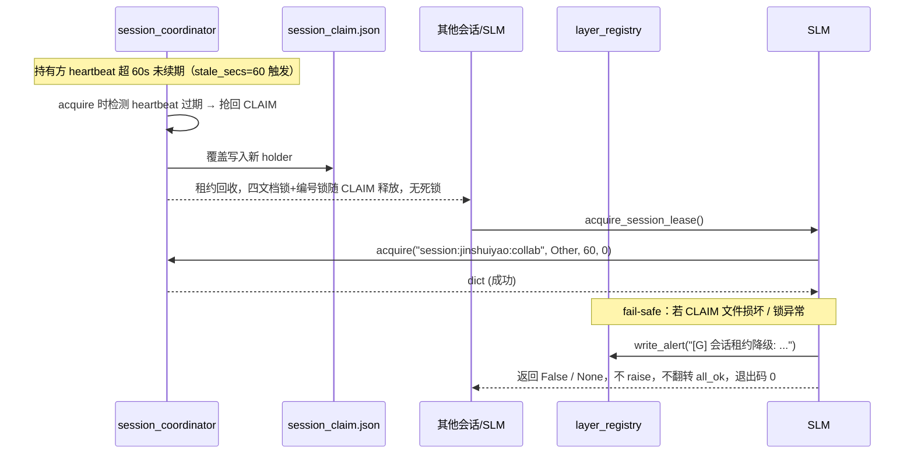

# 架构设计文档：⑤会话租约（JS-20260728-18）

> 基于 ④ 的 `session_coordinator` / `layer_registry` / `lease_helper` 复用扩展，零新增依赖，纯标准库。
> 作者：高见远（Gao）· 架构师 ｜ 委派：齐活林（Qi）· 交付总监 ｜ 编号：JS-20260728-18 ｜ 日期：2026-07-28

---

## 0. 设计前提与 ④ 真实接口盘点（已读源码）

为保证「与 ④ 兼容、工程师可直接动手」，本设计基于 ④ 三个脚本**真实签名**推导，关键事实如下：

| 模块 | 关键事实（来自源码） | 对 ⑤ 的含义 |
|------|----------------------|--------------|
| `session_coordinator.py` | `acquire(intent, holder, stale_secs=1800, wait_secs=0, poll=2)` 返回 dict；失败（被他者活占且 wait 耗尽）**抛 `RuntimeError`**；`release(holder, force=False)`；`heartbeat(holder)`；`status()` 返回**字符串**；**单全局 CLAIM**（`REPO_ROOT/.workbuddy/session_claim.json`，`REPO_ROOT=脚本目录.parent.parent` 即仓库 git 根 `模型/`，**非** `Jinshuiyao_Fixed/`） | ⑤ 会话租约 = 该单全局 CLAIM；TTL 用 `acquire(..., stale_secs=60)` 按调用覆盖（不改 ④）；获取失败需 `try/except RuntimeError` 降级 |
| `layer_registry.py` | `PROJECT_ROOT = Jinshuiyao_Fixed/`（比仓库根低一级）；常量 `LIVE_WRITABLE_WHITELIST` / `LEASE_REQUIRED_FILES` / `INSURANCE_PROTECTED`（均 **Jinshuiyao_Fixed 相对**）；`write_alert(msg, level="[G]")` 静默吞错；`is_lease_required` / `is_live_writable` | ⑤ 受保护清单须用**仓库根相对**坐标（与 `session_coordinator` 对齐），不能误用 layer_registry 默认的 Jinshuiyao_Fixed 坐标，否则物理定位错位 |
| `lease_helper.py` | `LeaseManager(registry, holder, sc_module)` 可注入 `sc_module`（测试替身）；`acquire_for_write(rel_path, intent, wait_secs=30)`→bool（失败降级 False）；`release()/heartbeat()/assert_live_writable/write_protected` 全 fail-safe | ⑤ `SessionLeaseManager` 沿用同款「可注入 sc_module + 全 fail-safe」范式，测试可零触碰真实全局锁 |

---

## 1. 实现方案 + 框架选型

### 1.1 技术挑战
- **会话级全局互斥**：四文档 + 决策卡 + 编号分配器，同一时刻仅一个 AI 会话可写，从根杜绝 Edit「String to replace not found」与并行撞号。
- **与 ④ 兼容**：不破坏 `lease_helper` / `layer_registry` 既有公共接口；复用 `session_coordinator` 单一全局 CLAIM。
- **fail-safe 降级**：锁获取失败 / 心跳异常 / CLAIM 文件损坏 → 仅 `[G]` 告警，不抛异常、不翻转 `all_ok`、退出码 0。
- **超时自动回收**：持有方崩溃 / 心跳超阈值 → 自动回收，避免死锁占坑。

### 1.2 框架与库选型
- 语言 Python 3.10+（与 ④ 一致）。**零新增第三方依赖**。
- 标准库：`json` / `os` / `time` / `platform` / `typing` / `datetime` / `pathlib`（均已为 ④ 所用）。
- 复用 ④：`session_coordinator`（底层 CLAIM 读写 + TTL 回收）、`layer_registry`（注册表 + `write_alert`）、`lease_helper`（④ 文件级租约，由 ⑤「包住」）。
- 架构模式：
  - **委托模式（Delegation）**：`SessionLeaseManager` 委托 `session_coordinator` 完成底层 CLAIM 读写与回收，自身只做会话级语义封装。
  - **注册表驱动（Registry-driven）**：被保护资源清单统一由 `layer_registry` 提供，④ 与 ⑤ 共用单一数据源（P1-2）。
  - **守卫 / 上下文模式（Guard / Context）**：`guard_four_docs_write` + `with SessionLeaseManager(...) as slm:` 上下文管理器，在写路径前做互斥校验。
  - **嵌套租约（Nested Lease）**：⑤ 会话级租约「包住」④ 文件级租约 —— 会话租约成立后才允许调用 `lease_helper.acquire_for_write`；四文档 + 编号分配器只受会话级租约保护（**不重复进入** ④ `LEASE_REQUIRED_FILES`，避免双重锁）。

### 1.3 与 ④ 的边界（主理人拍板，落地映射）

| PRD 待确认 | 主理人决策 | ⑤ 落地 |
|-----------|-----------|--------|
| TTL 默认值 | 60s | `SessionLeaseManager.DEFAULT_TTL=60`，通过 `acquire(..., stale_secs=60)` 调用覆盖（**不改 ④**）。⚠️ 注意：④ 实际 `STALE_SECS=1800`，与「与 ④ 心跳周期对齐」表述不符，见 §9 待明确 #1 |
| 边界划分 | ⑤ 包住 ④ | 会话租约成立后才允许 `lease_helper.acquire_for_write`；四文档 + 编号锁走会话级，不进 ④ 文件级清单 |
| 外部同步 | 保持 P2 | ⑤ 默认只管本地会话互斥（坚果云冲突仅 P2-2 提示/告警，非阻塞） |
| 编号分配器 | 无独立文件 | 用 `js_number_allocator` 逻辑资源锁（intent 标记）互斥，不新增物理文件 |
| 跨团队告警 | 仅 `[G]` | P2-1 标识可加，不通知主理人人工介入 |

### 1.4 关键架构结论（务必先读，影响 T01–T05）

> **④ `session_coordinator` 是「单全局 CLAIM」互斥模型**（整个仓库同一时刻仅一个 holder，无论 intent 是什么）。这意味着：
> 1. **⑤「会话级租约」就是该单全局 CLAIM**（intent=`session:jinshuiyao:collab`，`stale_secs=60`）。一旦某个会话持有它，其他会话无法就**任何**共享资源（含 ④ 文件级租约）动工 —— 天然强化隔离。
> 2. **「编号分配锁」在该模型下被全局 CLAIM 自然包含**：持会话租约即已串行化编号分配，无需再单独占一次锁（否则会与同一 CLAIM 冲突 / 互相覆盖）。
>    → 因此 `js_number_allocator` 设计为**逻辑子锁 / intent 标记**（记录在 claim 的 `intent` 或 `protected` 字段），不新增物理文件，也不二次 `acquire`。`allocate_number` 在「已持会话租约」前提下读总索引最大号、+1、返回；实际落盘仍由主理人幂等脚本在持锁下执行（职责单一，见 §9 #2）。
> 3. 若未来确需**真正独立的多 resource 锁**（会话锁与编号锁可分别持有），则需把 `session_coordinator` 从「单 CLAIM」扩展为「多 resource CLAIM」——属更大改动，列为 §9 #4 可选扩展，本期不做。

---

## 2. 文件列表及相对路径（相对 `Jinshuiyao_Fixed/`）

| 文件 | 状态 | 说明 |
|------|------|------|
| `scripts/session_lease.py` | **新增** | 核心交付：`SessionLeaseManager` 会话级租约管理器（acquire/release/heartbeat/allocate_number/is_protected_resource/guard_four_docs_write/status + 上下文管理器），全量 fail-safe |
| `scripts/layer_registry.py` | **修改** | 新增 `SESSION_PROTECTED_FILES`（仓库根相对坐标）、`JS_NUMBER_LOCK` 常量与 `is_session_protected(rel_path)` 方法；**`LEASE_REQUIRED_FILES` 保持不变**（四文档不重复进文件级清单，避免双重锁）；④ 既有公共接口零破坏 |
| `scripts/lease_helper.py` | **修改（非破坏性）** | 增加可选 `session_guard` 钩子（默认 `None`，老调用方不受影响），在 `write_protected` 前委派 `SessionLeaseManager.guard_four_docs_write`；或仅作为薄适配导出 `guard_session_protected(path)`。保持 `LeaseManager` 公共签名不变 |
| `tests/test_session_lease.py` | **新增** | 覆盖 acquire / 超时回收 / 编号互斥 / 四文档 guard / fail-safe 降级 |
| `../AI协作交接中心.md` | 引用（不改结构） | 四文档之一，被保护资源（仓库根相对路径） |
| `../AI协作规范_完整版.md` | 引用（不改结构） | 四文档之一 |
| `../工作留痕总索引.md` | 引用（不改结构） | 四文档之一，且为编号读取源（`allocate_number` 的 `read_max_fn` 指向此处） |
| `AGENTS.md` | 引用（不改结构） | 四文档之一（位于 `Jinshuiyao_Fixed/` 内） |
| `docs/风险登记册_*.md` 或团队风险册 | **修改（T08）** | 回填 JS-20260728-18 会话租约方案 |
| `.workbuddy/session_claim.json` | 运行时生成（**复用 ④**） | 全局 CLAIM 文件，相对仓库 git 根（= `模型/`），**不新建** |

> 坐标系说明：`SESSION_PROTECTED_FILES` 采用**仓库根相对**坐标（与 `session_coordinator` 一致），值为 `["AI协作交接中心.md","AI协作规范_完整版.md","工作留痕总索引.md","Jinshuiyao_Fixed/AGENTS.md"]`。切勿误用 layer_registry 默认的 Jinshuiyao_Fixed 相对坐标，否则三份根目录文档会被错定位到 `Jinshuiyao_Fixed/` 下。

---

## 3. 数据结构和接口（类图）

```mermaid
classDiagram
    direction LR
    class SessionCoordinator {
        <<复用④·不改>>
        +acquire(intent, holder, stale_secs, wait_secs, poll) dict
        +release(holder, force) bool
        +heartbeat(holder) bool
        +status() str
        -CLAIM_PATH: Path
        -STALE_SECS: int = 1800
    }
    class LayerRegistry {
        <<复用④·修改>>
        +LEASE_REQUIRED_FILES: list
        +LIVE_WRITABLE_WHITELIST: list
        +INSURANCE_PROTECTED: list
        +SESSION_PROTECTED_FILES: list {static}
        +JS_NUMBER_LOCK: str {static}
        +classify(rel_path) Layer
        +is_lease_required(rel_path) bool
        +is_live_writable(rel_path) bool
        +is_session_protected(rel_path) bool
        +write_alert(message, level) void
    }
    class LeaseManager {
        <<复用④·不改>>
        +acquire_for_write(rel_path, intent, wait_secs) bool
        +release() bool
        +heartbeat() bool
        +assert_live_writable(rel_path) bool
        +write_protected(rel_path, intent, fn, wait_secs) bool
    }
    class SessionLeaseManager {
        <<新增⑤>>
        +SESSION_LEASE_RESOURCE: str {static}
        +JS_NUMBER_LOCK: str {static}
        +DEFAULT_TTL: int {static} = 60
        -holder: str
        -team: str
        -_active: bool
        -_claim_path: Path
        +__init__(holder, team, repo_root, sc_module, registry)
        +acquire_session_lease(ttl, wait_secs) bool
        +release_session_lease() bool
        +heartbeat() bool
        +allocate_number(read_max_fn) int|None
        +is_protected_resource(path) bool
        +guard_four_docs_write(path) bool
        +status() dict
        +__enter__() SessionLeaseManager
        +__exit__(exc_type, exc, tb) None
    }
    SessionLeaseManager ..> SessionCoordinator : 委托 acquire/release/heartbeat
    SessionLeaseManager ..> LayerRegistry : 查询 SESSION_PROTECTED_FILES / write_alert
    SessionLeaseManager ..> LeaseManager : 「包住」④文件级租约(调用顺序约定)
    LeaseManager ..> SessionCoordinator : 委托
```

### 关键方法签名（仅签名与语义，无实现主体）

```python
# ===== scripts/session_lease.py（新增） =====
import json, os, time, platform
from pathlib import Path
import session_coordinator as _sc
from layer_registry import LayerRegistry, write_alert, SESSION_PROTECTED_FILES

class SessionLeaseManager:
    SESSION_LEASE_RESOURCE: str = "session:jinshuiyao:collab"   # 会话级全局租约 intent
    JS_NUMBER_LOCK: str = "js_number_allocator"                 # 编号分配逻辑锁标记
    DEFAULT_TTL: int = 60                                        # 秒；经 acquire(stale_secs=60) 覆盖 ④ 默认

    def __init__(self, holder=None, team="jinshuiyao",
                 repo_root=None, sc_module=None, registry=None) -> None: ...

    def acquire_session_lease(self, ttl: int = DEFAULT_TTL, wait_secs: int = 0) -> bool:
        """占全局 CLAIM（intent=会话租约）。被占用/异常 → [G] 告警 + False，绝不抛。"""

    def release_session_lease(self) -> bool:
        """显式释放；finally 清理 _active。"""

    def heartbeat(self) -> bool:
        """周期续期（默认 60s 一次），防 ④ 过期自愈误抢。"""

    def allocate_number(self, read_max_fn) -> int | None:
        """需持会话租约；读总索引最大号 → +1 → 返回建议号（落盘由主理人脚本负责）。
           read_max_fn: 由调用方注入的「读当前最大 JS 编号」函数，解耦 ⑤ 与四文档写逻辑。"""

    def is_protected_resource(self, path: str) -> bool:
        """path 为仓库根相对路径；经 layer_registry.is_session_protected 判定。"""

    def guard_four_docs_write(self, path: str) -> bool:
        """四文档写前守卫。机制异常→降级放行+[G]；正常未持租约→硬拒绝+[G]；持租约→放行。"""

    def status(self) -> dict:
        """结构化状态：held/holder/intent/heartbeat_age/stale/protected/team。"""

    def __enter__(self) -> "SessionLeaseManager": ...
    def __exit__(self, exc_type, exc, tb) -> None: ...
```

```python
# ===== scripts/layer_registry.py（修改：追加以下，既有接口不动） =====
# 注意：以下为「仓库根相对」坐标（与 session_coordinator 对齐），非本模块默认的 Jinshuiyao_Fixed 相对
SESSION_PROTECTED_FILES: list[str] = [
    "AI协作交接中心.md",
    "AI协作规范_完整版.md",
    "工作留痕总索引.md",
    "Jinshuiyao_Fixed/AGENTS.md",
]
JS_NUMBER_LOCK: str = "js_number_allocator"

def _norm_repo_rel(rel_path: str) -> str: ...

def is_session_protected(rel_path: str) -> bool: ...
# 同时给 LayerRegistry 类增补实例/类方法 is_session_protected（委托模块函数）
```

---

## 4. 程序调用流程（时序图）

### 4.1 会话启动 → 写四文档 → 释放（正常路径）



### 4.2 编号分配带锁互斥（防并行撞号）



### 4.3 超时自动回收 + fail-safe 降级



---

## 5. 任务列表（有序，含依赖，按实现顺序）

> 说明：主理人委派明确要求细化至 T01–T08（交付精度优先），故本节突破默认「≤5 任务」上限，属显式授权。

| 任务ID | 任务名 | 优先级 | 依赖 | 改动文件 | 设计要点 |
|--------|--------|--------|------|----------|----------|
| **T01** | 新增 `SessionLeaseManager` 核心类 | P0 | ④ 既有模块 | `scripts/session_lease.py`（新增） | 实现 §3 全部方法；`__init__` 可注入 `sc_module`/`registry`（同 ④ 测试范式）；全量 `try/except`+`write_alert` fail-safe；`_active` 状态机；`with` 上下文 |
| **T02** | 扩展 `layer_registry` 注册表 | P1 | ④ 既有模块 | `scripts/layer_registry.py`（修改） | 追加 `SESSION_PROTECTED_FILES`（**仓库根相对**坐标）、`JS_NUMBER_LOCK`、`is_session_protected()`；**不动** `LEASE_REQUIRED_FILES`（避免双重锁）；④ 公共接口零破坏 |
| **T03** | 四文档写保护接入 guard | P0 | T01, T02 | `scripts/session_lease.py`、`scripts/lease_helper.py`（非破坏性薄钩子） | `guard_four_docs_write`：机制异常→降级放行+`[G]`；正常未持租约→硬拒绝+`[G]`；持租约→放行。`lease_helper` 仅加默认 `None` 的可选 `session_guard` 参数，老调用不受影响 |
| **T04** | 编号分配锁原子化 | P0 | T01 | `scripts/session_lease.py` | `allocate_number(read_max_fn)`：校验 `_active` → `heartbeat()` 保活 → `read_max_fn()` 读最大号 → `+1` → 返回建议号；`js_number_allocator` 作为 intent/标记，不二次 `acquire`；异常降级 `None` |
| **T05** | 超时回收 + heartbeat 保活 | P0 | T01, T04 | `scripts/session_lease.py`（复用 `session_coordinator` 过期回收） | 复用 ④ 单 CLAIM 过期自愈（传 `stale_secs=60`）；`heartbeat()` 周期续期；`release_session_lease` 显式释放；崩溃自动回收无需新增线程 |
| **T06** | 状态查询 API | P1 | T01 | `scripts/session_lease.py` | `status()` 返回结构化 dict（持有者/剩余 TTL/被保护资源清单），供可观测（P1-3） |
| **T07** | 单元测试 | P0 | T01, T03, T04, T05 | `tests/test_session_lease.py`（新增） | 用注入 `sc_module` 内存假实现：acquire 成功/被占用、超时回收、编号互斥不撞号、四文档 guard 三类分支、fail-safe（CLAIM 损坏）降级 |
| **T08** | 风险册回填 + 四件套留痕 | P1 | T01–T07 | 团队风险册 / 四文档（`.md`） | 回填 JS-20260728-18 会话租约方案、编号铁律守护、fail-safe 姿态；在四文档补充分钟级留痕说明 ⑤ 租约机制 |

---

## 6. 依赖包列表

- **无新增第三方依赖**。
- 标准库（均为 ④ 已用）：`json` / `os` / `time` / `platform` / `typing` / `datetime` / `pathlib`。
- 复用 ④：`session_coordinator`（底层 CLAIM + 回收）、`layer_registry`（注册表 + `write_alert`）、`lease_helper`（④ 文件级租约，由 ⑤ 包住）。

---

## 7. 共享知识（跨文件约定）

- **会话租约 resource/intent 命名**：`session:<team>:<scope>` → 全局协作固定 `session:jinshuiyao:collab`。
- **编号锁标记**：`js_number_allocator`（逻辑子锁 / intent 标记，不新增物理文件）。
- **fail-safe 统一姿态**：所有锁操作包 `try/except`，异常时 `layer_registry.write_alert("[G] ...")` 静默吞错，返回 `False`/`None`/安全默认；**绝不 raise、绝不翻转 `all_ok`、进程退出码保持 0**。
- **坐标系铁律**：⑤ 受保护清单用**仓库根相对**路径（与 `session_coordinator` 的 `REPO_ROOT=模型/` 对齐）；`SESSION_PROTECTED_FILES=["AI协作交接中心.md","AI协作规范_完整版.md","工作留痕总索引.md","Jinshuiyao_Fixed/AGENTS.md"]`。**禁止**误用 layer_registry 默认的 Jinshuiyao_Fixed 相对坐标，否则三份根目录文档被错定位。
- **CJK 路径处理**：一律 `os.path`/`pathlib.Path` + `_norm` 正斜杠归一；路径以相对仓库根登记，运行时经 `repo_root` 推导绝对路径，规避多机盘符随机。
- **CLAIM 文件**：复用 ④ 的 `.workbuddy/session_claim.json`（相对仓库 git 根），不新建全局状态文件。
- **嵌套租约调用顺序**：先 `acquire_session_lease()` → 会话内 ④ 高频文件用 `lease_helper.acquire_for_write()`；四文档仅受会话租约保护（不进 ④ 文件级清单）；编号分配在持会话租约下再取 `js_number_allocator` 逻辑锁。
- **heartbeat 驱动**：由调用方（AI 会话）周期性调用 `SLM.heartbeat()`（默认 60s 一次）；不强制新增后台线程（保持简单、零依赖）。
- **holder 身份**：沿用 ④ `DEFAULT_HOLDER = f"{platform.node()}@{os.getpid()}"` 进程级唯一标识，避免误回收他者租约（跨团队标识由 `session:<team>:collab` 的 team 字段承载）。

---

## 8. 待确认问题回应（PRD §5 → 主理人拍板落地）

已在 §1.3 以表格形式回应 5 项待确认，核心落地：TTL=60（调用覆盖）、⑤ 包住 ④、外部同步保持 P2、编号用逻辑锁无物理文件、跨团队仅 `[G]`。

---

## 9. 待明确事项（架构层仍存疑，建议主理人裁决）

1. **TTL 与 ④ 实际值不符**：主理人决策称「60s 与 ④ 既有心跳周期对齐」，但 ④ 实测 `session_coordinator.STALE_SECS=1800`（30 分钟）。建议 ⑤ 用 `acquire(stale_secs=60)` 按调用覆盖（不改 ④），并在文档中纠正「对齐」措辞为「⑤ 自定义 60s TTL」。
2. **编号生成职责边界**：`allocate_number` 仅返回「建议号 = 当前最大号+1」还是应直接读写总索引落盘？本设计采用**职责单一**：⑤ 只管锁 + 读最大号 + 返回建议号，落盘由主理人幂等脚本在持锁下执行（避免 ⑤ 耦合四文档写入逻辑）。请确认此边界。
3. **「拒绝写入」语义分级**：正常态（租约机制可用 + 调用方未持租约）应**硬拒绝**（返回 False，不写）；锁机制故障态（fail-safe）仅 `[G]` 告警并**放行**。T03 已据此区分两类分支，建议固化为团队铁律。
4. **单全局 CLAIM 模型的限制（重要）**：④ 是单全局 CLAIM，故「会话租约」与「编号锁」在本期实为同一把锁（编号锁为逻辑子锁）。若未来需会话锁与编号锁**可分别持有**（如只读协作并发 + 编号独占），则须把 `session_coordinator` 扩展为「多 resource CLAIM」——属更大改动，本期不做，列为可选演进。
5. **全局单写是否过严**：会话租约为全局唯一，同一时刻仅一个 AI 会话可动四文档 + 编号。若未来需多会话**只读并行**，需引入 read/write 区分；本期按主理人决策维持严格互斥。

---

## 附：任务列表摘要表

| 任务ID | 描述 | 优先级 | 依赖 | 改动文件 |
|--------|------|--------|------|----------|
| T01 | 新增 `SessionLeaseManager` 核心类（acquire/release/heartbeat/allocate_number/guard/status + 上下文，全 fail-safe） | P0 | ④ 既有模块 | `scripts/session_lease.py`（新增） |
| T02 | 扩展 `layer_registry`：`SESSION_PROTECTED_FILES` + `JS_NUMBER_LOCK` + `is_session_protected`；`LEASE_REQUIRED_FILES` 不动 | P1 | ④ 既有模块 | `scripts/layer_registry.py`（修改） |
| T03 | 四文档写保护 guard：未持租约硬拒绝+`[G]`；机制异常降级放行；`lease_helper` 非破坏性薄钩子 | P0 | T01, T02 | `scripts/session_lease.py`、`scripts/lease_helper.py` |
| T04 | 编号分配锁原子化：`allocate_number(read_max_fn)` 持锁读最大号+1 返回建议号 | P0 | T01 | `scripts/session_lease.py` |
| T05 | 超时回收 + heartbeat 保活（复用 ④ 单 CLAIM 过期自愈，传 stale_secs=60） | P0 | T01, T04 | `scripts/session_lease.py` |
| T06 | 状态查询 API：`status()` 结构化返回持有者/剩余TTL/被保护资源 | P1 | T01 | `scripts/session_lease.py` |
| T07 | 单元测试：acquire/超时回收/编号互斥/四文档 guard/fail-safe（注入 sc_module） | P0 | T01, T03, T04, T05 | `tests/test_session_lease.py`（新增） |
| T08 | 风险册回填 + 四件套留痕说明 JS-20260728-18 | P1 | T01–T07 | 团队风险册 / 四文档（`.md`） |
