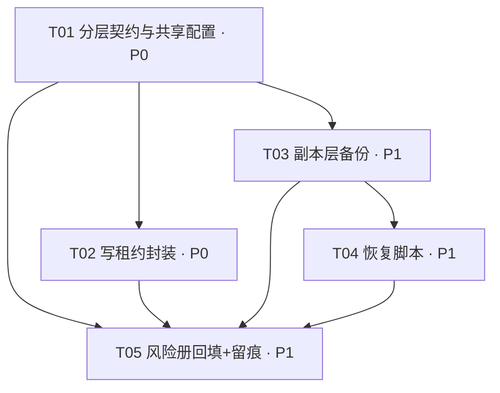

# 金水谣「④数据三层隔离（Data Three-Layer Isolation）」架构设计 + 任务分解

> 架构师：高见远（software-architect）｜基于产品经理许清楚 PRD（JS-20260728-17）+ 主理人已拍板 6 项决策
> 项目根：`Jinshuiyao_Fixed/`（以下路径均相对此根，CJK 路径一律用 `cd` 进入后操作，不用 `git -C`）
> 配套图：`docs/数据三层隔离_架构设计与任务分解_class.mermaid`（类图）、`..._seq.mermaid`（时序图）
> 编号：JS-20260728-17（已双查空闲，不占用其他编号）
> 范围声明：**本次仅做设计，不改任何代码**。涉及共享高冲突文件（AGENTS.md / .gitignore / risk_register.json / 工作留痕总索引.md）的"实际改动"只在本文描述**幂等改法**，留待工程师 T 阶段执行，以降低与另一路并发 AI（matches / 诺亚团队）的写冲突。

---

## 0. 设计结论速览（一页纸）

| 项 | 结论 |
|----|------|
| 一句话方案 | **活层运行时 + 副本层周期快照(`金水谣数据/backups/`) + 保险层版本化真源(`git` + `金水谣数据/insurance/`)，共享高频写文件经 `session_coordinator` 全局租约串行化，全链路 fail-safe 降级为 `[G]` 告警。** |
| 三层边界 | 活层=`金水谣数据/`(运行时)；副本层=`金水谣数据/backups/`(派生快照, gitignore)；保险层=`git 真源` + `金水谣数据/insurance/`(受控脚本写、活层只读) |
| 写租约 | **复用 `scripts/session_coordinator.py` 的 `acquire/release/heartbeat` 全局 CLAIM**（与 matches 团队共用 → 跨团队串行化，直击撞号+互删事故）；覆盖决策卡/经验箱/brain_state/predictions/knowledge/ |
| 副本保留窗口 | 默认 **24×每小时 + 7×每日 + 4×每周**；大文件(>1MB，如 predictions.json)降频到 每日/每周；旧 `*.json.bak.0~2` 首次运行迁移进副本层并保留兼容期 |
| 保险层防误改 | 活层代码写保险层路径触发 `[G]` 告警（白名单 `LayerRegistry.LIVE_WRITABLE_WHITELIST` 外即告警），不阻断 |
| 坚果云同步 | 活层**不**跨机实时同步；副本层/保险层**可**同步（决策 #5，与 JS-20260728-05/09 衔接） |
| 失败姿态 | 隔离/备份/租约**任何异常一律 `[G]` 告警**（写 `金水谣数据/log/` 告警日志），不抛异常阻断主流程（与①门禁去盲区一致） |
| 依赖 | **纯标准库（os/shutil/json/hashlib/argparse/datetime/time/pathlib/re），零新依赖** |
| ④与⑤/⑥边界 | ④只做：目录隔离 + 副本快照 + 基础写锁（复用 session_coordinator）；⑤做会话级统一编排、⑥做全局快照一致性——④不重复造轮子 |
| 任务数 | **5 个**（T01 分层契约/共享配置 → T02 写租约封装 → T03 副本备份 → T04 恢复 → T05 风险册回填+留痕） |

---

## 1. 代码现状确认（实测，非记忆）

| 文件/机制 | 确认结论（与④的关系） |
|-----------|----------------------|
| `scripts/session_coordinator.py` | 已有文件租约：`acquire(intent, holder, wait_secs=0)` / `release(holder, force)` / `heartbeat(holder)`，单一全局 CLAIM(`.workbuddy/session_claim.json`)，30min 心跳自愈。**④直接复用其 `acquire/release/heartbeat` 作为写锁底层**，不重写算法（决策 #4）。现有 `PROTECTED_REL` 已含 `ai_decisions.md`(决策卡)，但**未含** brain_state/predictions/经验箱/knowledge——④通过"约定清单"扩面，不改 session_coordinator 源码（低冲突）。 |
| `scripts/jinshuiyao_data_guard.py` | ①产出：`check_jinshuiyao_data(override)` 守护金水谣数据 12 目录/21 文件强校验。**④副本自检(P1-4)复用它做"副本/保险快照可读"联动**，不重写。 |
| `scripts/gen_risk_md.py` + `scripts/verify_risk_register.py` | ②产出：json→md 同源渲染；`verify(path)->(ok,errors,warns)` 可被 import。④落地后 T05 仅把 R-002 `mitigation_status` 改 `已落地` 并重跑 `gen_risk_md.py`，**不新写风险册逻辑**。 |
| `金水谣数据/risk_register.json` | R-002 当前 `mitigation_status="待落地(项④)"`，`owner="备份机制(项④)"`。④落地后改 `已落地`（⚠️ 共享高冲突，幂等改法见 T05）。 |
| `.gitignore` | 已排除 `金水谣数据/lot_data/`、`users/`、`stock/cache/` 等运行时，**但未排除 `金水谣数据/backups/`**；已排除 `*.json.bak.*`（旧三代，兼容期保留）。④需 append `金水谣数据/backups/`（⚠️ 共享高冲突，append 幂等）。`insurance/` 不 ignore（属保险层真源，须入库）。 |
| `AGENTS.md` | 现有"五高铁律"+代码审查 Pipeline 铁律。④需**追加"数据三层隔离铁律"**一段（⚠️ 共享高冲突，幂等：已存在同标题块则跳过）。 |
| `tools/auto_backup.py` | 现有启动快照（写 `%LOCALAPPDATA%/Jinshuiyao/backups`，与同步树隔离）。④副本层**刻意放在同步树内**(`金水谣数据/backups/`，允许跨机同步)，与 auto_backup 的"隔离策略"意图不同但互补，不冲突、不复用其代码。 |
| `金水谣数据/backups/` | **已存在**且仅有 `gui/main_window.py/main_window_20260715_234106.py` 一份 GUI 备份。④将其扩展为统一副本层根（按 `<tier>/<rel_path>/<ts>.bak` 组织）。 |
| `金水谣数据/insurance/` | **尚不存在**，本次由 T01 建目录骨架（受控脚本写、活层只读）。 |
| `工作留痕总索引.md` | 位于**仓库根** `./工作留痕总索引.md`（PRD 写 `模型/` 为历史路径，实际以根为准）。④登记 JS-20260728-17（⚠️ 共享高冲突，幂等：编号已存在则跳过）。 |

---

## 2. 实现方案 + 框架选型（Part A.1）

### 2.1 核心技术挑战
1. **共享高频写文件并发互删/撞号**：多会话（含跨团队 matches）写同一文件无协调 → 历史事故。需写前租约、写后释放。
2. **单层故障跨层扩散**：运行时数据边界模糊，损坏/误写/丢失波及其他层。需物理目录三层 + 读写权限隔离。
3. **可恢复性与 RPO 可知**：活层误改/丢失需回退最近恢复点，且能倒查溯源。需周期副本 + 版本化保险 + manifest 校验。
4. **fail-safe 不阻断**：隔离/备份/租约异常不能硬失败（否则违背①门禁去盲区）。需统一 `[G]` 告警降级。
5. **并发写共享文件的冲突风险**：本 workspace 另一路 AI 正并发写同一仓库。设计文档是新文件（冲突低），但凡涉及改 AGENTS.md/.gitignore/risk_register.json/总索引，必须**幂等（已存在则跳过）**，实际改动留 T 阶段。

### 2.2 框架与库选型
- **主语言**：Python 3.10~3.14（与项目一致）。
- **零新依赖**：仅用标准库 `os` / `shutil` / `json` / `hashlib` / `argparse` / `datetime` / `time` / `pathlib` / `re`。
- **复用现有资产（不重写）**：
  - 租约底层 → `scripts/session_coordinator.py` 的 `acquire/release/heartbeat`（全局 CLAIM，跨团队串行化）。
  - 数据守护 → `scripts/jinshuiyao_data_guard.check_jinshuiyao_data`（副本自检联动）。
  - 风险册 → `scripts/gen_risk_md.py` / `verify_risk_register.py`（R-002 回填复用）。
- **架构模式**：**轻量模块分层**（非 OOP 框架），每个职责一个 `Manager` 类 + 一个 `LayerRegistry` 契约中心，组合而非继承，符合项目"禁止过度工程/私造轮子"铁律④。

### 2.3 分层归属与读写权限（落盘契约）
| 层 | 物理位置 | 写权限 | git 跟踪 | 丢失后果 | 失败姿态 |
|----|----------|--------|----------|----------|----------|
| 活层 Live | `金水谣数据/`（运行时子目录：lot_data/users/stock/fund/...、`brain_state.json`、`predictions.json`、`log/ai_decisions.md`、`log/经验收集箱.md`、`knowledge/` 等） | server/AI/脚本（共享文件须先租约） | 否（`*.json`/`*.log` 等已被 `.gitignore` 排除） | 可接受（可重建/回退） | fail-safe 告警 |
| 副本层 Replica | `金水谣数据/backups/`（`gui/` 已存在；新增 `<tier>/<rel_path>/<ts>.bak`） | **仅备份脚本** | 否（派生快照，`.gitignore` 加 `金水谣数据/backups/`） | 可接受（退化到保险层） | fail-safe 告警 |
| 保险层 Insurance | `git` 真源（`.py`/`config/*.json`/`启动提示词.txt`/`AGENTS.md`/`docs/*`/`risk_register.json`）+ `金水谣数据/insurance/`（决策卡/经验箱/risk_register 快照归档） | 人类/受控流程（git commit、受控备份脚本）；**活层运行时代码只读** | 是（真源/文档/insurance 归档） | 几乎不可接受（最终防线） | 受控写 + 强校验 |

> 演示/真实数据全局铁律（P1-3，决策落地）：所有"真实赛果/真实用户数据"与"演示/补充/脱敏数据"必须物理分文件/分目录，命名含 `_real` / `_demo` / `_supplemented` 后缀（参考现有 `matches_real.csv` vs `matches_supplemented.csv`）。④在其 `LayerRegistry` 中把 `_real` 文件标为保险层关注、演示数据标为活层派生，并提供 `classify()` 校验。

---

## 3. 文件列表及相对路径（Part A.2）

### 3.1 新增文件
| 路径 | 作用 | 所属层 |
|------|------|--------|
| `scripts/layer_registry.py` | **分层归属契约中心**：`Layer` 枚举、`FileEntry`、`LayerRegistry`（白名单/租约清单/备份清单/频率档/`classify`/`is_live_writable`） | 契约层 |
| `scripts/lease_helper.py` | `LeaseManager`：封装 `session_coordinator` 的 `acquire/release/heartbeat`，提供 `write_protected()` / `acquire_for_write()` / `assert_live_writable()` | ④基础写锁 |
| `scripts/data_backup.py` | `BackupManager`：活层→副本层周期快照、滚动保留、`migrate_legacy_bak()`、manifest、自检联动 guard | 副本层 |
| `scripts/data_restore.py` | `RestoreManager`：从副本/保险恢复、hash 校验、恢复报告 | 恢复 |
| `docs/数据分层约定.md` | 文件归属清单 + 三层约定 + 演示/真实铁律（人类可读，PRD-17-P0-1 交付物） | 文档/保险 |
| `金水谣数据/insurance/` | 运行时重要成果归档目录（决策卡/经验箱/risk_register 快照），受控脚本写、活层只读（T01 建骨架，含 `.gitkeep`） | 保险层 |
| `金水谣数据/backups/manifest.json` | 快照清单：每快照 `sha256`+`mtime`+`size`+`point`+`tier`（运行时生成） | 副本层 |

### 3.2 改动文件（实际改动留 T 阶段，本文给幂等改法）
| 路径 | 改动 | 高冲突 ⚠️ | 幂等改法 |
|------|------|----------|----------|
| `.gitignore` | append `金水谣数据/backups/`（副本层派生，排除入库）；保留 `*.json.bak.*` 兼容期 | ⚠️ | 仅当文件中**不存在**该行时追加；不删既有行 |
| `AGENTS.md` | 追加"数据三层隔离铁律"一段（白名单/租约/备份恢复脚本/fail-safe） | ⚠️ | 仅当文件中**不存在**该标题块（如 `## 数据三层隔离铁律`）时插入；已存在则跳过 |
| `金水谣数据/risk_register.json` | R-002 `mitigation_status`：`待落地(项④)` → `已落地` | ⚠️ | 仅当该值仍为 `待落地(项④)` 时改；已 `已落地` 则跳过；改后重跑 `gen_risk_md.py` |
| `金水谣数据/风险登记册.md` | 由 `gen_risk_md.py` 重生成（R-002 状态刷新） | ⚠️(生成物) | 重跑脚本即覆盖；属生成物非手工 |
| `工作留痕总索引.md`（仓库根） | 登记 JS-20260728-17 一条（编号+经手AI+改动文件+验证+关联 R-002） | ⚠️ | 仅当索引中**不存在** `JS-20260728-17` 时追加；已存在则跳过 |

> ⚠️ 冲突缓解总原则：上述 4 个共享文件的实际写入由工程师在 T 阶段执行；**所有改法均"已存在则跳过"**，且建议工程师在执行前先 `git stash`/确认无他者占锁（复用 `session_coordinator status`），把并发互覆盖概率压到最低。设计文档本身为新文件，不与现有文件冲突。

---

## 4. 数据结构和接口（Part A.3 · 类图）

> 完整 mermaid 见 `docs/数据三层隔离_架构设计与任务分解_class.mermaid`。

**核心契约 `LayerRegistry`（scripts/layer_registry.py）**
```python
class Layer(Enum):
    LIVE = "live"; REPLICA = "replica"; INSURANCE = "insurance"

@dataclass
class FileEntry:
    rel_path: str          # 相对项目根，如 "金水谣数据/brain_state.json"
    layer: Layer
    freq_tier: str         # "hourly"|"daily"|"weekly"|"none"
    lease_required: bool   # 是否共享高频写，须先租约
    git_tracked: bool

class LayerRegistry:
    LIVE_WRITABLE_WHITELIST: list[str]      # 活层代码可写路径（白名单）
    LEASE_REQUIRED_FILES: list[str]        # 决策卡/经验箱/brain_state/predictions/knowledge/
    INSURANCE_PROTECTED: list[str]         # insurance/ 与 git 真源，活层只读
    def classify(rel_path) -> Layer
    def is_lease_required(rel_path) -> bool
    def is_live_writable(rel_path) -> bool   # 非白名单/保险层 → False（调用方发[G]）
    def get_backup_entries() -> list[FileEntry]
    def get_freq_tier(rel_path) -> str
```

**写锁 `LeaseManager`（scripts/lease_helper.py，复用 session_coordinator）**
```python
class LeaseManager:
    def __init__(self, registry: LayerRegistry): ...
    def acquire_for_write(rel_path, intent, wait_secs=30) -> bool
    def release() -> bool
    def assert_live_writable(rel_path) -> bool   # 违规→[G]告警并返回 False
    def write_protected(rel_path, intent, writer_callable, wait_secs=30) -> bool
    # 内部全部委托 session_coordinator.acquire/release/heartbeat（全局 CLAIM）
```

**副本 `BackupManager`（scripts/data_backup.py）**
```python
class BackupManager:
    replica_root: Path            # 金水谣数据/backups/
    retention: dict               # {"hourly":24,"daily":7,"weekly":4}
    manifest_path: Path          # 金水谣数据/backups/manifest.json
    def run_once() -> int                       # 跑一轮所有条目快照
    def snapshot(rel_path, tier) -> bool
    def _prune(tier) -> None                    # 滚动保留
    def migrate_legacy_bak() -> int             # 旧 *.json.bak.0~2 迁移进副本层
    def build_manifest() -> None
    def self_check() -> bool                    # 联动 jinshuiyao_data_guard
```

**恢复 `RestoreManager`（scripts/data_restore.py）**
```python
@dataclass
class RecoveryReport:
    file: str; source: str; target: str; ok: bool
    hash_before: str; hash_after: str; message: str

class RestoreManager:
    replica_root: Path; insurance_root: Path; manifest_path: Path
    def list_points(rel_path) -> list            # 该文件可用恢复点
    def restore(rel_path, point="latest") -> RecoveryReport
    def _verify(snapshot_path, expected_hash) -> bool
    def generate_report(...) -> RecoveryReport
```

---

## 5. 程序调用流程（Part A.4 · 时序图）

> 完整 mermaid 见 `docs/数据三层隔离_架构设计与任务分解_seq.mermaid`。三张图：①并发写共享文件 acquire→write→release；②周期快照触发；③恢复流程。

**① 并发写共享文件（直击撞号+互删事故）**
- 会话A/会话B（含跨团队 matches）调 `LeaseManager.write_protected(file, intent, fn)`。
- `LeaseManager` 委托 `session_coordinator.acquire(intent, wait_secs=30)`：**全局 CLAIM 被 A 占→B 排队等待**，B 在 A `release()` 后才拿到锁写。→ 串行化，无互删。
- 任一异常（锁超时/写失败）→ `[G]` 告警 + 清理 `release()`，**不抛异常阻断主流程**（fail-safe）。

**② 周期快照触发（副本层）**
- 定时器(`core/scheduler`，配置 `config/scheduler.json`)→ `BackupManager.run_once()`。
- 读 `LayerRegistry.get_backup_entries()` → 逐条：`acquire_for_write`(防读半截被并发写) → 读活层 + `sha256` → 写 `backups/<tier>/<rel_path>/<ts>.bak` → `_prune(tier)` 滚动保留 → `release()`。
- 末了 `build_manifest()` + `self_check()`(联动 `jinshuiyao_data_guard`)。失败一律 `[G]` 告警。

**③ 恢复流程**
- 运维/主理人调 `RestoreManager.restore(rel_path, point="latest")`。
- 查 `manifest.json` 得 `expected_hash` → 读副本快照 → `_verify`(sha256 比对)。
- 通过：`acquire_for_write` → 覆盖写活层 → 释放 → 出 `RecoveryReport(ok=True)`。
- 失败/缺失：`[G]` 告警 → `RecoveryReport(ok=False)`。不抛异常。

---

## 6. 任务分解（Part B.7 · 有序、含依赖、≤5）

> 验收点均基于 `Jinshuiyao_Fixed/`。改动类型：新增 / 改。⚠️ = 会改共享高冲突文件（按第 3.2 节幂等改法执行，实际改动留 T 阶段）。

### T01 分层契约与共享配置（P0）
- **涉及文件**：
  - 新增 `scripts/layer_registry.py`（LayerRegistry + 白名单 + 租约清单 + 备份清单 + `classify`）
  - 新增 `docs/数据分层约定.md`（文件归属清单 + 三层约定 + 演示/真实铁律）
  - 新增 `金水谣数据/insurance/` 骨架（含 `.gitkeep`，受控脚本写、活层只读）
  - 改 ⚠️ `.gitignore`（append `金水谣数据/backups/`，幂等）
  - 改 ⚠️ `AGENTS.md`（追加"数据三层隔离铁律"，幂等）
- **依赖**：无
- **优先级**：**P0**
- **验收**：`layer_registry.classify("金水谣数据/brain_state.json")==LIVE`；`is_lease_required` 覆盖决策卡/经验箱/brain_state/predictions/knowledge；`insurance/` 目录存在且活层对其中文件 `is_live_writable()==False`；`.gitignore` 含 `金水谣数据/backups/`；AGENTS.md 含铁律块；`docs/数据分层约定.md` 枚举每类文件归属层。

### T02 写租约封装（P0）
- **涉及文件**：
  - 新增 `scripts/lease_helper.py`（`LeaseManager`，委托 `session_coordinator.acquire/release/heartbeat` + `write_protected`/`assert_live_writable`）
  - 改 `scripts/layer_registry.py`（提供 `LEASE_REQUIRED_FILES` 供 lease_helper 读取；补单测所需导出）
  - 新增 `tests/test_lease_helper.py`（模拟双会话并发写同文件，验证串行化 + fail-safe）
- **依赖**：T01
- **优先级**：**P0**
- **验收**：并发 2 会话写同一共享文件时后者排队而非覆盖（复现历史事故场景通过）；`acquire` 失败/超时 → `[G]` 告警且不抛异常；`assert_live_writable` 对 insurance/git 真源返回 False 并触发告警。

### T03 副本层备份（P1）
- **涉及文件**：
  - 新增 `scripts/data_backup.py`（`BackupManager`：快照/滚动保留/`migrate_legacy_bak`/manifest/自检）
  - 改 `scripts/layer_registry.py`（提供 `get_backup_entries`/`get_freq_tier`，含大文件降频档）
  - 新增 `tests/test_data_backup.py`（验证 24h/7d/4w 滚动 + 旧 `.bak` 迁移）
- **依赖**：T01
- **优先级**：**P1**
- **验收**：关键文件按频率档生成副本；滚动保留达 24×hourly+7×daily+4×weekly；旧 `*.json.bak.0~2` 首次运行迁移进副本层且旧文件保留兼容；`manifest.json` 含 sha256；`self_check` 联动 `jinshuiyao_data_guard`；失败仅 `[G]` 告警。

### T04 恢复脚本（P1）
- **涉及文件**：
  - 新增 `scripts/data_restore.py`（`RestoreManager`：list_points/restore/_verify/generate_report）
  - 改 `scripts/layer_registry.py`（提供 insurance 路径解析供跨层恢复）
  - 新增 `tests/test_data_restore.py`（验证 hash 一致恢复 + 损坏快照告警）
- **依赖**：T03
- **优先级**：**P1**
- **验收**：指定文件可恢复到指定时点；恢复前后 sha256 一致；损坏/缺失快照 → `[G]` 告警 + `RecoveryReport(ok=False)`；产出可读恢复报告；不抛异常阻断。

### T05 风险册回填 + 留痕登记（P1）
- **涉及文件**：
  - 改 ⚠️ `金水谣数据/risk_register.json`（R-002 `mitigation_status`：`待落地(项④)`→`已落地`，幂等）
  - 改 ⚠️ `金水谣数据/风险登记册.md`（重跑 `gen_risk_md.py` 生成）
  - 改 ⚠️ `工作留痕总索引.md`（仓库根，登记 JS-20260728-17，幂等）
  - 复用 `scripts/gen_risk_md.py` / `scripts/verify_risk_register.py`（不改源码，仅调用）
- **依赖**：T01、T02、T03、T04
- **优先级**：**P1**
- **验收**：R-002 `mitigation_status==已落地`；`verify_risk_register.py` 退出码 0；总索引含 JS-20260728-17 一条且关联 R-002；所有共享文件改动均幂等（重跑无副作用）。

> 任务依赖图（mermaid）见第 9 节。T02 与 T03 并行（均只依赖 T01）；T04 依赖 T03；T05 依赖全部。线性链最短=3（T01→T03→T04→T05）。

---

## 7. 依赖包（Part B.6）

**纯标准库，零新依赖**（与项目"禁止新增无用依赖"铁律④一致）：
- `os`、`shutil`、`json`、`hashlib`、`argparse`、`datetime`、`time`、`pathlib`、`re`（Python 3.10~3.14 自带）
- **复用现有资产（不新增）**：
  - `scripts/session_coordinator.py`（`acquire/release/heartbeat` 租约底层）
  - `scripts/jinshuiyao_data_guard.py`（`check_jinshuiyao_data` 自检联动）
  - `scripts/gen_risk_md.py` + `scripts/verify_risk_register.py`（风险册回填）
- 无需 `pip install` 任何包。

---

## 8. 共享知识（Part B.8 · 跨文件约定）

1. **fail-safe 统一降级**：隔离/备份/租约**任何异常**一律降级为 `[G]` 告警（写入 `金水谣数据/log/` 告警日志，建议文件 `金水谣数据/log/isolation_alerts.log`），**绝不抛异常阻断主流程**（与①门禁去盲区一致）。
2. **租约复用全局 CLAIM**：④写锁**复用 `session_coordinator` 全局 CLAIM**（`.workbuddy/session_claim.json`），与 matches 团队共用 → 跨团队串行化，直击撞号+悬空提交事故。新增共享写文件只需在 `LayerRegistry.LEASE_REQUIRED_FILES` 登记，**不改 session_coordinator 源码**。
3. **三层物理边界**：活层=`金水谣数据/`；副本层=`金水谣数据/backups/`；保险层=`git 真源` + `金水谣数据/insurance/`。副本层允许坚果云同步，活层**不**跨机实时同步（决策 #5，与 JS-20260728-05/09 衔接）。
4. **副本命名与清单**：快照路径 `金水谣数据/backups/<tier>/<rel_path_sanitized>/<YYYYMMDD_HHMMSS>.bak`；`<rel_path_sanitized>` 把 `/` 替换为 `__`。`金水谣数据/backups/manifest.json` 记录每条 `{rel_path, tier, ts, sha256, mtime, size}`。
5. **活层可写白名单**：由 `LayerRegistry.LIVE_WRITABLE_WHITELIST` 定义；任何对保险层(`insurance/` 与 git 真源)或非白名单路径的活层写 → `LeaseManager.assert_live_writable` 返回 False 并触发 `[G]` 告警（PRD-17-P0-3）。
6. **git 约定**：仓库级 `user.name="金水瑶助手"` / `user.email="jinshuiyao@local"`；CJK 路径一律 `cd` 进入后用相对路径操作，**禁止 `git -C`**（防 CJK 路径编码问题）。保险层真源须 `git commit` 入库（铁律⑥）。
7. **共享文件幂等改法**：凡改 AGENTS.md / .gitignore / risk_register.json / 工作留痕总索引.md，一律"已存在则跳过"，且执行前先确认无他者占锁（复用 `session_coordinator status`），降低与并发 AI 的写冲突。
8. **旧 `.bak` 迁移**：`*.json.bak.0~2` 由 `BackupManager.migrate_legacy_bak()` 首次运行迁移进副本层机制；迁移后旧文件保留兼容期（不立即删），新备份走新命名。
9. **演示/真实铁律**：真实数据(`*_real*`)标保险层关注、演示/补充(`*_demo*`/`*_supplemented*`)标活层派生；`classify()` 校验命名后缀合规，违规 `[G]` 告警。
10. **副本自检联动**：`BackupManager.self_check()` 调用 `check_jinshuiyao_data()`，副本/保险快照损坏或缺失 → `[G]` 告警（R-002 early_signal）。

---

## 9. 任务依赖图（Part B.9 · mermaid）



---

## 10. 待明确事项（Part A.5 · 仅列确实无法替主理人决定的）

> 其余 6 项决策已落地，以下为 genuinely 需主理人/跨项确认、且不影响 T01–T04 开工的边角：

1. **insurance/ 大文件 git 策略**：`insurance/` 下决策卡/经验箱/risk_register 快照默认**纳入 git 跟踪**（保险层真源）。但若单归档文件 > 1MB（如经验箱整本），是否改为 gitignore + 仅 manifest 跟踪以防仓库膨胀？需主理人确认阈值与策略（影响 T01 的 `.gitignore` 措辞）。
2. **活层"不跨机实时同步"的落地手段**：决策 #5 已定"活层不跨机实时同步"，但是否需要新增坚果云忽略规则（如 `.nutstoreignore` 或在同步客户端排除 `金水谣数据/` 运行时子目录）属同步客户端配置，超出④代码范围，且与多机部署项（JS-20260728-05/09）强相关——建议由⑤/多机部署项统一落地，④仅文档化约束。需主理人确认归属。
3. **副本磁盘上限阈值**：默认保留窗口 24×hourly(对 predictions.json 390KB≈9.4MB/天) + 7×daily + 4×weekly。是否设单文件副本总大小硬上限（如 >200MB 自动降频到 daily/weekly）？本设计给 200MB 保守默认值，可配置；若主理人有更严上限请告知（非阻塞，T03 用默认值）。
4. **租约等待上限 `wait_secs` 默认值**：本设计取 30s（超时则 fail-safe 告警+尽力写）。与⑤会话级统一编排对齐时可能调整；非阻塞，先用 30s。

---

## 11. 与现有约定/风险登记册衔接（收尾核对）

- **R-002**：④落地后 `mitigation_status` 由 `待落地(项④)` → `已落地`（T05 幂等回填）；`owner=备份机制(项④)` 维持。
- **R-003**：④提供"写串行化"基础（复用 session_coordinator），"全局快照一致性"归⑤/⑥，本设计不重复。
- **①门禁去盲区**：`BackupManager.self_check()` 复用 `check_jinshuiyao_data()`，金水谣数据强校验项缺失→`[G]` 告警（R-002 early_signal）。
- **③数据铁律**：演示/真实物理隔离经 `LayerRegistry` + `docs/数据分层约定.md` 推广为全局规则。
- **fail-safe**：全链路 `[G]` 告警不阻断，与①门禁"默认只告警不阻断 / verify 硬失败"一致。
- **编号**：JS-20260728-17 双查空闲，T05 登记于 `工作留痕总索引.md`（仓库根）。
