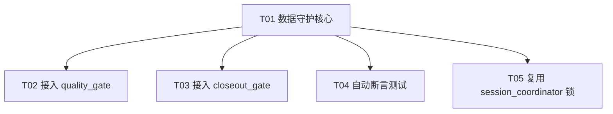

# 金水谣「门禁去盲区」增量架构设计 + 任务分解

> 架构师：高见远（Gao）｜基于产品经理 PRD + 主理人已拍板决策
> 项目根：`Jinshuiyao_Fixed/`（以下路径均相对此根）
> 配套图：`docs/class-diagram.mermaid`（类/模块关系）、`docs/sequence-diagram.mermaid`（调用与测试流程）

---

## 0. 设计结论速览（一页纸）

| 项 | 结论 |
|----|------|
| 路径 | **路径 B**：新增独立轻量目录级守护，不动 `EXCLUDE_DIRS`（避免把高频运行时文件拉进 MD5 快照→误报破门禁） |
| 阻断强度 | **fail-safe**：默认仅**告警（WARN 级，不计入硬失败）**，不硬阻断收工；真实"硬阻断"由**自动断言测试 + 每日巡检**承担 |
| OVERRIDE 透传 | 复用 `core.pipeline_mode.OVERRIDE` 的"只警告不阻断"语义；因该模式是**进程内变量**、子进程恒为 NORMAL，实际落地为「默认即非阻断 + 可选 `--override` 显式确认」 |
| 与 check_vital_docs 关系 | **并存不冲突**：`check_vital_docs` 守 7 份命门文档（含 `金水谣数据/风险登记册.md`、`log/ai_decisions.md`）；新函数守**目录级**更广集合，并**显式跳过**已归命门的 2 份，杜绝重复报 |
| 锁复用 | P1-2：写金水谣数据时复用现有 `session_coordinator.acquire/release` 锁 |
| 依赖 | **纯标准库（os/re/json/subprocess/sys/pathlib），零新依赖** |
| 任务数 | **5 个**（T01 守护核心 → T02/T03/T04/T05 星型依赖 T01） |

---

## 1. 实现方案

### 1.1 核心思路

在 `scripts/` 下新增**独立模块** `jinshuiyao_data_guard.py`，集中定义：
- `JINSHUIYAO_DATA_DIR` 锚点（`os.path.join(PROJECT_DIR, "金水谣数据")`）
- `STRONG_DIRS`：必须存在的业务根目录（整目录被删=典型事故）
- `STRONG_FILES`：必须存在且为"唯一/难重建当前态"的核心文件
- `EXCLUDE_PATTERNS`：运行时高频写入/缓存/备份/派生物的排除正则（**防误报核心**）
- `check_jinshuiyao_data() -> bool`：扫描并返回是否完好

`quality_gate.py` 与 `closeout_gate.py` **均调用同一函数**，避免逻辑分叉（单一事实源）。

### 1.2 挂接点与主流程并入

```
quality_gate.main() 默认模式（原 345–362 行）:
    baseline_ok = verify_baseline()
    vital_ok   = check_vital_docs()
    data_ok    = check_jinshuiyao_data()      # ← 新增调用
    test_ok    = run_tests()
    ...
    if not data_ok:  WARN += 1                # ← 只计警告，不进 failures（fail-safe）

quality_gate.main() verify 模式（原 337–342 行）:
    ok       = verify_baseline()
    vital_ok = check_vital_docs()
    data_ok  = check_jinshuiyao_data()        # ← 新增调用
    all_ok   = ok and vital_ok and data_ok     # data 缺失→all_ok=False→退出码1（verify 场景应硬报错）
```

> 设计分歧处理（已按主理人"不反问"原则拍板，作为明确假设）：
> - **默认模式**下 data 缺失 = **WARN 级**（打印红色【FAIL/告警】行，但 `print_summary` 显示"⚠ 通过但有 N 个警告"，退出码 0）→ 兑现"不硬阻断收工"+"避免误报反噬门禁"。
> - **verify 模式**（`--verify`，人工主动核对基线）下 data 缺失 = **硬失败**（退出码 1）→ 该场景本就是"我主动要验证"，应如实报错。
> - 真实"阻断"保障交给**自动断言测试（第 4 节）**与 **closeout 每日巡检**，二者对"模拟删除"给出确定性红灯。

### 1.3 与 check_vital_docs 并存、不冲突

| 守护函数 | 守护范围 | 重叠处理 |
|----------|----------|----------|
| `check_vital_docs()`（既有，不动） | 7 份命门文档（跨根级 + `金水谣数据/风险登记册.md`、`log/ai_decisions.md`） | 权威方 |
| `check_jinshuiyao_data()`（新增） | 目录级：业务根目录存在性 + 核心当前态文件 | **显式排除** `风险登记册.md`、`log/ai_decisions.md`，避免重复报红 |

---

## 2. 保护范围清单（关键防误报）

### 2.1 强校验 STRONG（缺失 → 红色告警）

**A. 业务根目录存在性（整目录被删=事故主战场）**

| 目录 | 理由 |
|------|------|
| `金水谣数据/lot_data/` | 彩票历史数据根，循环删事故主战场 |
| `金水谣数据/backtest_results/` | 回测资产，删了无法复盘 |
| `金水谣数据/agent_memory/` | 智能体记忆唯一副本 |
| `金水谣数据/log/` | 决策/日志根（目录存在性；其下文件见 2.2 弱校验） |
| `金水谣数据/stock/`、`fund/`、`fund_data/`、`music/`、`creator_output/`、`secure/`、`users/`、`review/` | 各业务域根目录 |

**B. 核心"当前态"文件（每个 = 唯一难重建）**

| 文件 | 理由 |
|------|------|
| `lot_data/双色球.json`、`大乐透.json`、`快乐8.json`、`七乐彩.json`、`七星彩.json`、`排列三.json`、`福彩3D.json` | 7 彩种历史主数据，删=历史全失 |
| `predictions.json`、`reference_pool.json` | 预测与参考池核心 |
| `correlation_matrix.json`、`brain_state.json`、`risk_state.json`、`engines.json`、`schemes.json`、`evolution_rules.json`、`evolution_patterns.json`、`user_themes.json`、`free_model_status.json` | 模型/引擎/风险状态，重建成本高 |
| `lottery_health_report.json` | 彩票健康报告关键产出 |
| `agent_memory/pending_reminders.json`、`agent_memory/history.json` | 智能体记忆唯一副本 |

**C. 命门文档（交给 `check_vital_docs`，新函数显式跳过，不重复报）**
- `金水谣数据/风险登记册.md`、`金水谣数据/log/ai_decisions.md`

### 2.2 弱校验 / 排除（防误报核心，避免误报破门禁）

| 类别 | 模式/路径 | 处理 | 理由 |
|------|-----------|------|------|
| 备份 | `*.bak.N`、`*.bak.*`（`lot_data/*.bak.0~2` 等） | **排除** | 可重建、高频变化，拉进门禁必天天破 |
| 运行时日志 | `log/*.log`、`*.logl`、`ai_conversations.jsonl`、`automation_mirror.jsonl`、`scheduler_*.jsonl`、`health_*.jsonl`、`jinshuiyao.log`、`*.audit.log*` | **排除内容/仅目录存在**（2.1A 已守目录） | 持续追加重写，内容随时变 |
| 缓存/派生 | `cache/`、`fund/cache/`、`stock/cache/`、`video_cache/`、`_backup_time_backfill/`、`backups/`、`fund_reports/` | **排除** | 可重建派生物 |
| 测试产物 | `test_creator_output/`、`test_creator_review/` | **排除** | 测试临时产出 |
| 审计/日志子目录 | `lot_data/log/`、`log/err_log/`、`secure/access_logs/` | **弱校验**（仅目录存在） | 日志类，内容可变 |
| 小配置 | `log/manifest.json` 等 | **弱校验**（存在即过） | 易重建 |

> **防误报总原则**：只强校验"唯一且难重建的当前态 + 关键目录存在性"，把一切运行时高频写入/缓存/备份/派生物排除，从源头消除"误报破门禁"这一头号失败模式。

---

## 3. 阻断逻辑 & OVERRIDE 透传

### 3.1 fail-safe 告警落点

- `check_jinshuiyao_data()` 内部：缺失项打印 `❌ 金水谣数据盲区: <path> 缺失`（红色醒目），返回 `False`。
- `quality_gate.main()` 默认模式：`data_ok=False → WARN += 1`（**不进 failures**）→ 退出码 0。
- `quality_gate.main()` verify 模式：`all_ok=False → 退出码 1`（如实硬报错）。

### 3.2 OVERRIDE 透传（复用现有铁律，不自造）

- 现有通道语义：`core.pipeline_mode.OVERRIDE` = "门禁只警告不阻断"（见 `pipeline_mode.py` 第 13 行注释）。
- **关键约束**：`pipeline_mode._PIPELINE_MODE` 是**进程内全局**，quality_gate/closeout_gate 作为独立子进程运行时**恒为 NORMAL**，跨进程读不到 AI 会话里设的 OVERRIDE。
- **落地方案（忠实复用语义 + 适配子进程现实）**：
  1. 默认行为已是非阻断（fail-safe），故"OVERRIDE 可过"天然满足——任何删除都只告警、不拦收工。
  2. 预留显式确认钩子：quality_gate / closeout_gate 接受 `--override` 参数（或环境变量 `JINSHUIYAO_OVERRIDE=1`），命中时把红色【FAIL】降级为 🟡 黄灯"已人工确认，放行"，与现有 OVERRIDE 铁律"人工确认后放行"语义一致。
  3. 不自造新的权限体系，仅复用"只警告不阻断 + 人工确认"这一既有铁律的表达。

---

## 4. 复用 session_coordinator 锁（P1-2 顺路项）

- 现有接口（已在 `quality_gate.main()` 复用）：`session_coordinator.acquire(intent, wait_secs=0)` / `session_coordinator.release()`。
- **写金水谣数据时加锁**推荐调用点（待工程师 grep 确认精准行号）：
  - `core/auto_knowledge.py` / `core/ai_decisions_extractor.py`：写 `log/ai_decisions.md` 前。
  - `gui/data_store.py`：写 `predictions.json` / `reference_pool.json` 前。
  - `core/dispatch_lottery.py`（及 lot_data 写入路径）：写 `lot_data/*.json` 前。
- 封装（可选，降低重复）：在 `session_coordinator.py` 新增便捷函数 `acquire_data_lock(intent="写金水谣数据")` 与 `release_data_lock()`，内部 `try: acquire(...) finally: release()`，失败（他者占锁）→ 抛 RuntimeError 由调用方按现有共识处理（跳过/重试）。
- 锁仅防"并发互删/互覆盖"，不替代门禁；与 `quality_gate` 占锁互不冲突（同一 `session_coordinator` 实例，租约互斥）。

---

## 5. 测试演示脚本设计（决策④ 自动断言）

新增测试文件：`tests/test_quality_gate_data_guard.py`（pytest，纳入现有 `pytest tests/ -q` 约 740 项）。

| 用例 | 操作 | 断言 |
|------|------|------|
| `test_guard_green_when_intact` | 全量完好 | `assert check_jinshuiyao_data() is True` |
| `test_guard_red_on_file_delete` | 临时 rename `lot_data/双色球.json` → `.tmp`（finally 必还原） | `assert check_jinshuiyao_data() is False`（红灯） |
| `test_guard_red_on_dir_delete` | 临时 move 整 `lot_data/` 目录（finally 必还原） | `assert check_jinshuiyao_data() is False` |
| `test_guard_green_after_restore` | 删除后还原 | `assert check_jinshuiyao_data() is True`（绿） |
| `test_guard_excludes_bak` | 删 `lot_data/双色球.json.bak.0` | `assert check_jinshuiyao_data() is True`（bak 不触发） |

**接入 quality_gate 主流程**：测试直接 `import scripts.jinshuiyao_data_guard` 调函数；同时 `tests/` 增加一条"全流程"用例——subprocess 跑 `python scripts/quality_gate.py` 后，断言 stdout 含盲区告警文案（默认模式不破门禁、仅告警）。

**接入 closeout_gate 每日巡检**：`closeout_gate.main()` 新增 `[G] 金水谣数据完整性`（warning 级，不翻转 `all_ok`），每日 23:30 巡检时若被破坏即打印告警。测试 `test_closeout_reports_data_issue`：mock 删除强校验项 → 跑 closeout（`--quiet`）→ 断言输出含 `[G]` 告警标记。

---

## 6. 任务分解（≤5，星型依赖 T01）

> 验收点均基于 `Jinshuiyao_Fixed/`。改动类型：改=修改既有 / 新增=新建。

### T01 数据守护核心模块（基础设施）
- **涉及文件**：
  - 新增 `scripts/jinshuiyao_data_guard.py`（常量 `STRONG_DIRS`/`STRONG_FILES`/`EXCLUDE_PATTERNS` + `check_jinshuiyao_data()` + 可选 `--override` 读取）
  - 改 `scripts/quality_gate.py`（顶部 import 该模块）
  - 改 `docs/门禁去盲区_架构设计与任务分解.md`（本文，记录铁律）
- **依赖**：无
- **优先级**：P0
- **验收**：模块可独立 `import`；`check_jinshuiyao_data()` 对完好态返回 True、对缺 `lot_data/` 返回 False；排除 `*.bak.*` 与 `log/*.log`。

### T02 接入 quality_gate 主流程
- **涉及文件**：
  - 改 `scripts/quality_gate.py`（默认模式第 345–362 行、verify 模式第 337–342 行两处接入 `check_jinshuiyao_data()`；默认=WARN 级、verify=硬失败）
  - 改 `scripts/jinshuiyao_data_guard.py`（`--override` 降级逻辑联调）
  - 改 `core/pipeline_mode.py`（仅确认可 import，不改逻辑；文档注明子进程限制）
- **依赖**：T01
- **优先级**：P0
- **验收**：默认模式缺数据→退出码 0 且 stdout 含红色告警；`--verify` 缺数据→退出码 1；`--override`→黄灯放行。

### T03 接入 closeout_gate 每日巡检
- **涉及文件**：
  - 改 `scripts/closeout_gate.py`（main 第 240–262 行区新增 `[G]` 金水谣数据完整性，warning 级）
  - 改 `scripts/jinshuiyao_data_guard.py`（与 T02 同模块，确认复用同一函数）
  - 改 `docs/门禁去盲区_架构设计与任务分解.md`（记录巡检接入点）
- **依赖**：T01
- **优先级**：P1
- **验收**：缺数据时 closeout 报告 `[G]` 告警但不翻转 `all_ok`（不硬阻断收工）；`--quiet` 输出含 `[G]` 标记。

### T04 自动断言测试（决策④）
- **涉及文件**：
  - 新增 `tests/test_quality_gate_data_guard.py`（5+ 用例，含删除/恢复/排除 bak）
  - 改 `scripts/quality_gate.py`（确保可被 import 且主流程覆盖该函数）
  - 改 `scripts/closeout_gate.py`（确保 `[G]` 可被测试触发）
- **依赖**：T01（建议 T02/T03 完成后联调）
- **优先级**：P0
- **验收**：`pytest tests/test_quality_gate_data_guard.py -q` 全绿；模拟删除→断言 False/红灯；恢复→断言 True/绿；bak 删除不触发。

### T05 复用 session_coordinator 锁（P1-2 顺路项）
- **涉及文件**：
  - 改 `scripts/session_coordinator.py`（可选新增 `acquire_data_lock`/`release_data_lock` 便捷封装）
  - 改 `gui/data_store.py`（写 predictions/reference_pool 前加锁）
  - 改 `core/auto_knowledge.py` 或 `core/ai_decisions_extractor.py`（写 ai_decisions.md 前加锁）
- **依赖**：T01（锁本身已存在，仅接调用点）
- **优先级**：P2
- **验收**：写金水谣数据关键路径在 `acquire` 后、`release` 前完成；他者占锁时按现有共识跳过/重试，不互覆盖。

### 任务依赖图


---

## 7. 依赖包

**纯标准库，零新依赖**（与主项目"禁止新增无用依赖"铁律一致）：
- `os`、`re`、`json`、`subprocess`、`sys`、`pathlib`（Python 3.10~3.14 自带）
- 复用既有：`scripts/session_coordinator.py`、`core/pipeline_mode.py`（仅读取 OVERRIDE 语义）

---

## 8. 待明确事项（工程师/用户确认边角）

1. **默认模式是否彻底非阻断**：本设计默认 `data_ok=False → WARN 级、退出码 0`。若主理人希望默认模式也对"真删除"硬失败（退出码 1），需改为计入 `failures`；当前按"避免误报反噬门禁"取非阻断。
2. **OVERRIDE 跨进程**：`pipeline_mode.OVERRIDE` 是进程内变量，子进程读不到。若要 AI 会话设的 OVERRIDE 真正传导到 quality_gate 子进程，需把模式持久化到 `.workbuddy/pipeline_mode.json`（超出本增量范围，建议后续项）。当前以 `--override` 显式确认为替代。
3. **强校验文件清单的边界**：`free_model_status.json`、`user_themes.json` 等是否纳入强校验，取决于其是否"唯一难重建"——已按"当前态核心"纳入，工程师可据实际写入频率微调 `STRONG_FILES`。
4. **写锁调用点的精准行号**：T05 的 `gui/data_store.py`、`core/auto_knowledge.py` 等写路径需在实现时 grep 确认确切加锁位置（本设计给的是模块级推荐点）。
5. **closeout `[G]` 是否计入硬失败**：本设计取 warning 级（不翻转 `all_ok`，与 `[D]` 同待遇），以保持"不硬阻断收工"一致；若希望每日巡检对数据破坏硬失败，改为计入 `all_ok`。
